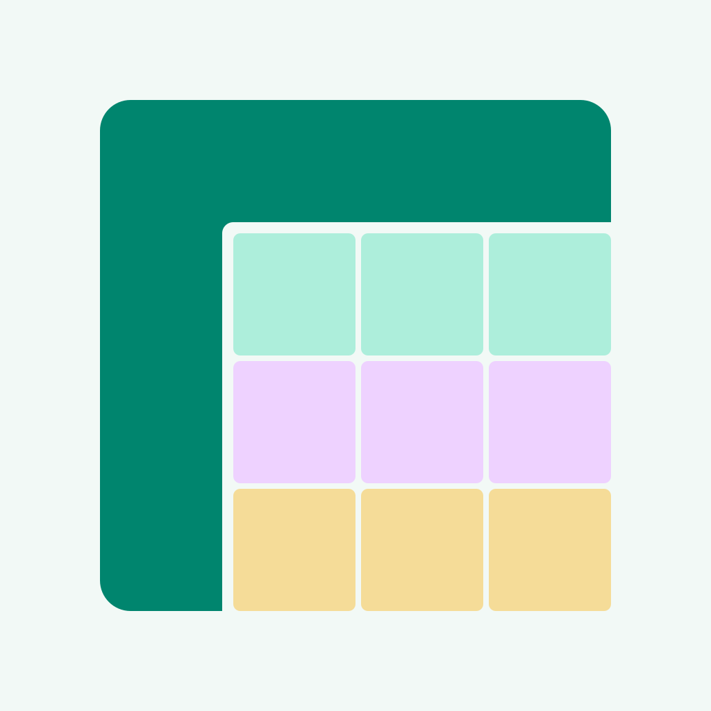
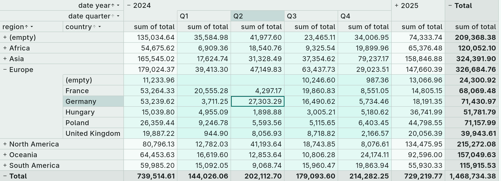

# tessera

[](https://github.com/nagylzs/tessera/actions/workflows/ci.yml)



Analyze, group and aggregate tabular data in Dart and Flutter: a pivot-table
engine with expandable row/column hierarchies, and widgets to display and
edit the result.

This repository is a [pub workspace](https://dart.dev/tools/pub/workspaces)
with these packages:

| Package | Depends on | What it is |
|---|---|---|
| [`packages/tessera`](packages/tessera) | nothing | The engine: data sources, schema inference, fact table, cube, layout, localized strings. Pure Dart — servers, CLIs, isolates and the web. |
| [`packages/tessera_flutter`](packages/tessera_flutter) | `tessera`, Flutter | `CubeView`, the axis and aggregate editors, picker dialogs, `CubeTheme`, `TesseraLocalizations`. Its `example/` is the demo app. |
| [`packages/tessera_xlsx`](packages/tessera_xlsx) | `tessera`, `archive`, `xml` | `XlsxDataSource` (import a worksheet) and `XlsxCubeExporter` (write a cube as a formatted worksheet). Pure Dart. |
| [`packages/tessera_ods`](packages/tessera_ods) | `tessera`, `archive`, `xml` | `OdsDataSource` and `OdsCubeExporter`: the same for OpenDocument spreadsheets (LibreOffice Calc). Pure Dart. |
| [`packages/tessera_html`](packages/tessera_html) | `tessera` | `HtmlCubeExporter`: a cube as an HTML table with merged headers and a stylesheet from `CubeExportTheme`. Pure Dart. |
| [`packages/tessera_svg`](packages/tessera_svg) | `tessera` | `SvgCubeExporter`: a cube as a scalable image, content-sized columns, themed with `CubeExportTheme`. Pure Dart. |
| [`packages/tessera_pdf`](packages/tessera_pdf) | `tessera`, `pdf` | `PdfCubeExporter`: paginated pages with repeated headers, fit to width or tiling, embedded fonts, page header/footer. Pure Dart. |

Every exporter renders a `CubeLayout` without Flutter; further formats
can be added the same way.

> **Status: 0.2.x.** Published on pub.dev under the
> [nagylzs.eu](https://pub.dev/publishers/nagylzs.eu) publisher; the API may
> still change before 1.0 (see each CHANGELOG).

## Scope and alternatives

tessera is for turning a flat table of facts into an interactive pivot:
group by any columns on two axes, expand and collapse groups, sort by
values or aggregates, show the result in a Flutter grid or write it to a
file. The engine runs wherever Dart runs, so the same cube can be built on
a server or in a CLI. A few things are deliberately out of scope; these
packages cover them:

- **Charts.** tessera draws tables only. The engine's `ChartData` and
  `ScatterData` turn a layout, the facts or one cell's drill-down into
  chart-ready series (labels, typed X values, doubles); draw them with a
  charting package such as [`fl_chart`](https://pub.dev/packages/fl_chart)
  or
  [`syncfusion_flutter_charts`](https://pub.dev/packages/syncfusion_flutter_charts).
- **Editing cells and general data grids.** The grid is read-only and
  shaped by the cube. For an editable, general-purpose grid see
  [`pluto_grid`](https://pub.dev/packages/pluto_grid) or
  [`syncfusion_flutter_datagrid`](https://pub.dev/packages/syncfusion_flutter_datagrid),
  which also offers a pivot mode.
- **Server-side and lazy data.** A cube is computed from a `FactTable` in
  memory (millions of rows are fine; see the engine README). Querying a
  database on demand is the job of your data layer; load the result into a
  `ListDataSource` or implement `DataSource`.
- **DataFrame-style manipulation.** Joins, reshaping and column arithmetic
  belong to a data-frame library such as
  [`dartframe`](https://pub.dev/packages/dartframe); tessera starts where
  the table is ready to be grouped.
- **Reading Excel workbooks in full.** `tessera_xlsx` and `tessera_ods`
  read one sheet as rows and write one formatted sheet. For workbooks
  with formulas, charts and many sheets use
  [`excel`](https://pub.dev/packages/excel).

## Documentation

- [User guide](docs/README.md) — fourteen chapters with screenshots: data
  sources, schema and import, facts, the cube, aggregates, filters, the
  expression language, the widgets, theming, export, localization,
  saving and restoring, large data.
- [docs/snapshot.md](docs/snapshot.md) — the binary snapshot format
  (`TesseraSnapshot`), for writing snapshots from other software.

## Development

```bash
dart pub get                                  # resolves the whole workspace
dart analyze                                  # all packages
(cd packages/tessera && dart test)            # engine
(cd packages/tessera_flutter && flutter test) # widgets
(cd packages/tessera_flutter/example && flutter run)
dart format packages
```

## Author

László Zsolt Nagy <nagylzs@gmail.com>

## License

MIT — see [LICENSE](LICENSE).
