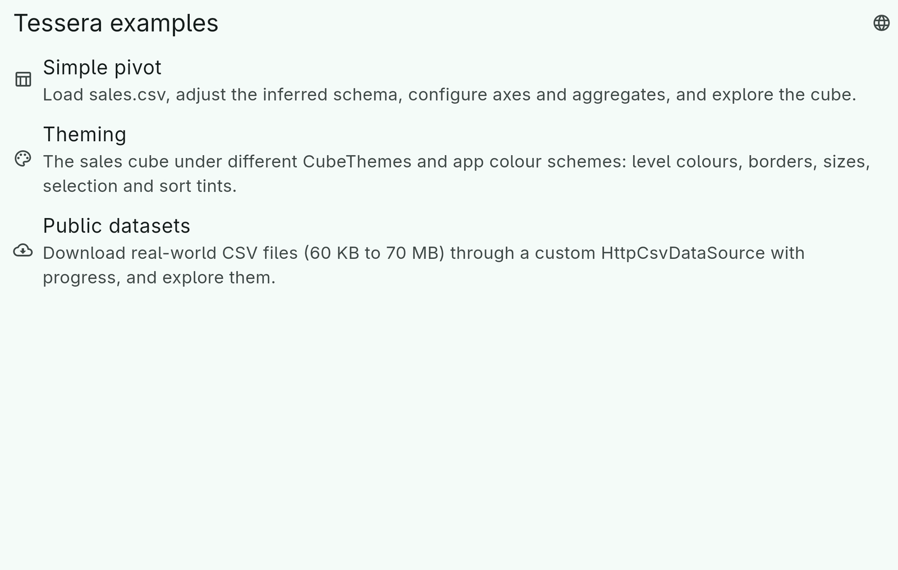

# 1. Getting started

## Packages

Tessera is a set of packages on pub.dev. Pick what you need:

| Package | Add it when you want |
|---|---|
| `tessera` | The engine: sources, schema, fact table, cube, expressions, CSV export, localized strings. Pure Dart, no Flutter — servers, CLIs, isolates and the browser. |
| `tessera_flutter` | The widgets. Re-exports `tessera`, so one import gives you both. |
| `tessera_xlsx`, `tessera_ods` | Read a sheet of an Excel or OpenDocument file as a source, write a cube as a formatted sheet. |
| `tessera_html`, `tessera_svg`, `tessera_pdf` | Write a cube as a web page, an image or a paginated document. |

```yaml
dependencies:
  tessera_flutter: ^0.2.0   # or tessera: ^0.2.0 for a Dart-only project
```

## From a CSV file to a grid

Three steps: load the facts, describe the cube, show it.

```dart
import 'package:tessera_flutter/tessera_flutter.dart';

// 1. Load. The types of the columns are inferred from a sample of rows.
final source = CsvDataSource.fromData(bytes, name: 'sales.csv');
final result = await loadFacts(source);
final facts = result.facts;          // an immutable, columnar FactTable

// 2. Describe the cube: what goes on the rows, the columns, and in the cells.
final spec = CubeSpec(
  rows: CubeAxis.of([
    const ColumnDimension('region'),
    const ColumnDimension('country'),
  ]),
  columns: CubeAxis.of([
    const DatePartDimension('date', DatePart.year),
    const DatePartDimension('date', DatePart.quarter),
  ]),
  aggregates: [
    Aggregate.sum(const Measure('total')),
    Aggregate.count,
  ],
);

// 3. Show it. The controller is the one mutable object; the widgets
//    read from it and write back to it.
final controller = CubeController(Cube(facts: facts, spec: spec));

Column(children: [
  AxisEditor(controller: controller, side: AxisSide.rows),
  AxisEditor(controller: controller, side: AxisSide.columns),
  AggregateEditor(controller: controller),
  Expanded(child: CubeView(controller: controller)),
]);
```

The grid starts with the first level of each axis visible and a total row
and column. Tap `+` in a header to expand a group, tap a dimension title
to sort, use the chips to add and remove dimensions and aggregates. The
[widgets chapter](09-widgets.md) has the details; for the localized
texts the app needs a `TesseraLocalizations.delegate` in its
`MaterialApp` (see [localization](12-localization.md)).

The same three steps work without Flutter. `packages/tessera/example/main.dart`
reads the CSV, builds the cube and writes it back out as CSV, from the
command line:

```
cd packages/tessera && dart run example/main.dart
```

## The example app

`packages/tessera_flutter/example` is a small launcher with three pages.
The screenshots in this guide come from it.



- **Simple pivot** loads `sales.csv`, lets you edit the inferred schema,
  the axes, the aggregates and the filter, and export the result.
- **Theming** is the same cube under the built-in theme presets, colour
  seeds and light/dark.
- **Public datasets** downloads real CSV files, 60 KB to 70 MB, through
  a custom HTTP data source with progress reporting.

```
cd packages/tessera_flutter/example
flutter run        # any desktop; -d chrome works too, except the datasets page (dart:io)
```

## Where things are

The engine has three layers, each a directory under `packages/tessera/lib/src`:

1. **Source and schema** — `DataSource` yields rows; `inferSchema` and
   `ColumnSpec` decide their types.
2. **Facts** — `FactTableImporter` builds the `FactTable`; `Dimension`s
   and `Measure`s are views on its columns.
3. **Cube** — `CubeSpec` plus expansion state make a `Cube`, whose
   `CubeLayout` is what a renderer draws.

The widgets are layer four, in `tessera_flutter`. Exporters render a
`CubeLayout` and live in their own packages. Nothing in the engine
imports Flutter, so a cube built on a server is the same object a client
displays.
