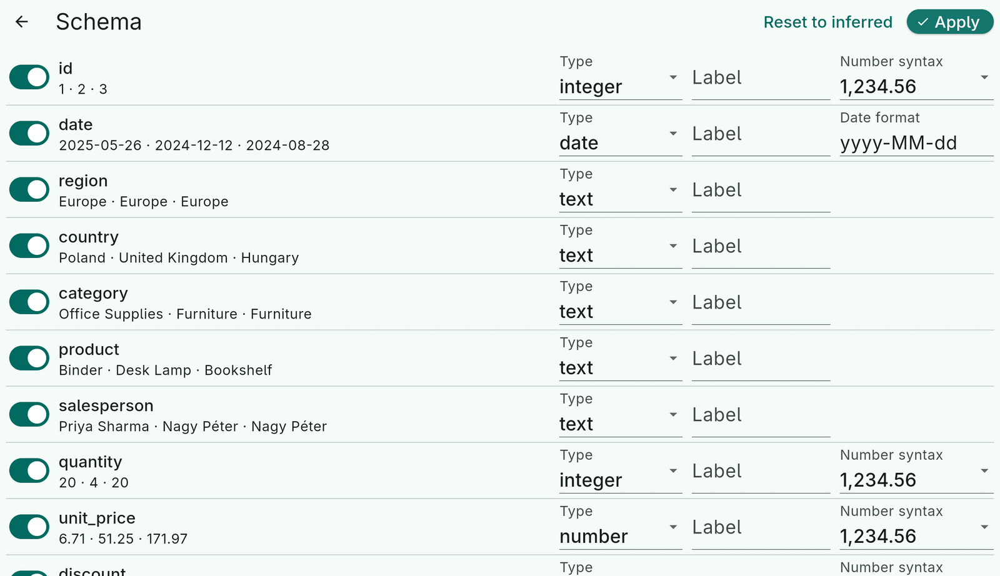
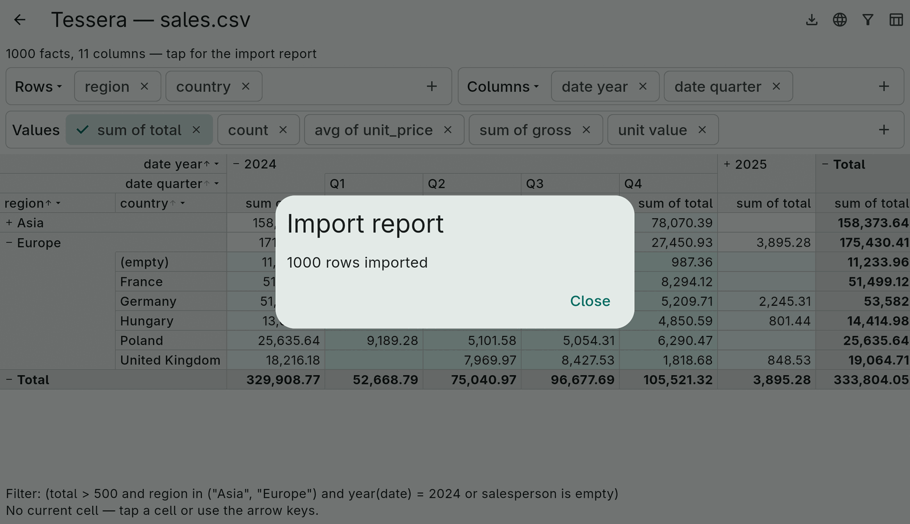

# 3. Schema and import

Between a source's rows and the fact table sits the **schema**: one
`ColumnSpec` per column saying what type its values have and how to parse
them. Tessera proposes a schema by looking at the data; you can adjust it;
the importer applies it.

## Column types

| `ColumnType` | Stored as | Notes |
|---|---|---|
| `text` | `String`, dictionary-encoded | The fallback when nothing else fits. |
| `integer` | `int` (exact up to 2⁵³) | |
| `number` | `double` | |
| `boolean` | `bool` | `true`/`false` and `yes`/`no`, case-insensitive. |
| `date` | UTC-midnight `DateTime` | A calendar day. |
| `dateTime` | `DateTime` | A point in time. |

Numeric columns can be measures; every column can be a dimension.

## Inference

```dart
final schema = await inferSchema(source);
final schema = await inferSchema(source,
    options: const InferenceOptions(sampleRows: 5000, numberSyntax: NumberSyntax.european));
```

`inferSchema` reads the first `sampleRows` (default 1000) and picks, per
column, the narrowest type every sampled value fits: integer before
number before text, date before dateTime, booleans only when every value
is one of the recognized words. Dates are matched against
`InferenceOptions.dateFormats`, a list of patterns tried in order (the
ISO forms first, including `2024-01-05T10:30:00.000Z` as JSON producers
write it); the winning pattern lands in `ColumnSpec.format`. Values in
`nullValues` (`""`, `null`, `NULL`, `n/a`, `N/A`, `NA`, `-` by default)
are ignored. A source with a `declaredSchema` skips all of this.

Inference is a *proposal*. Because it sees a sample, a column of integers
with a decimal on row 20 000 is still proposed as `integer`; the import
sorts that out (below).

## Adjusting the schema

`ColumnSpec` is immutable; `copyWith` and `Schema.replace` give you edited
copies:

```dart
final edited = schema
    .replace(schema['discount']!.copyWith(type: ColumnType.number))
    .replace(schema['id']!.copyWith(include: false))              // skip a column
    .replace(schema['country']!.copyWith(label: 'Country'))       // display name
    .replace(schema['posted']!.copyWith(format: 'dd.MM.yyyy'))    // date pattern
    .replace(schema['price']!.copyWith(numberSyntax: NumberSyntax.european));
```

- `label` is what widgets, headers and exports show; the column keeps its
  `name` for dimensions and expressions.
- `format` is a date pattern in the usual letters: `yyyy`, `MM`, `dd`,
  `HH`, `mm`, `ss`, `SSS`, with any literal separators.
- `numberSyntax` names the decimal and thousands separators;
  `NumberSyntax.standard` is `1,234.56`, `.european` is `1.234,56` and
  `1 234,56`.
- `nullValues` is the set of raw strings that mean "missing" for this
  column.
- `parser` is the escape hatch: a function from the raw value to a value
  of the column's type (or `null`), for anything the other fields cannot
  express. It is a Dart closure, so it cannot be saved in JSON.

The demo app's schema page is a UI over exactly these fields:



Label-only edits are cheap — the demo relabels the facts in place with
`FactTable.withLabels` — while a type or inclusion change means a
re-import.

### Remembering edits per structure

People tend to open the same export again and again. `Schema.structureKey`
is a canonical key for the *shape* of a source — the JSON list of its
column names, in order, such as `["region","product","amount"]` — so an
application can save the user's edited schema (with `CubeJson.encodeSchema`)
under the key of the inferred schema and apply it to the next file with the
same columns. The key deliberately ignores types: inference looks at a
sample of rows, so two files of the same structure can infer differently,
and that is exactly when a remembered correction is worth applying. Take
the key from the schema `inferSchema` returned, which lists every source
column; exclusions and labels the user makes later do not change it.

## Import

```dart
final result = await const FactTableImporter().import(source, schema);
final facts = result.facts;
final report = result.report;
```

`loadFacts(source)` does inference and import in one call;
`loadFacts(source, schema: edited)` imports with your schema. For big
files use `loadFactsInIsolate` ([large data](14-large-data.md)).

### When a value does not fit

The schema says `integer`, the value is `12.5`. `TypeMismatchPolicy`
decides:

- **`widen`** (the default): the column becomes the narrowest type that
  holds every value seen so far — `integer` → `number` → `text`, `date` →
  `dateTime` → `text` — and the rows already stored are converted. The
  import always succeeds and no row is lost. Already-parsed values are
  converted from their typed form, so if an integer column widens to text,
  an original `007` has become `7`.
- **`nullify`**: keep the type, store `null`, count it.
- **`fail`**: throw `ImportException` at the first offending value.

```dart
const FactTableImporter(policy: TypeMismatchPolicy.nullify, maxIssues: 50)
```

### The report

`ImportReport` says what happened: `rowsRead`, `rowsImported`,
`widenedColumns` (column → new type), `nullifiedPerColumn`, and up to
`maxIssues` `issues` with the row, column and raw value. Show it to the
user; it is the answer to "why is my quantity column text?".


