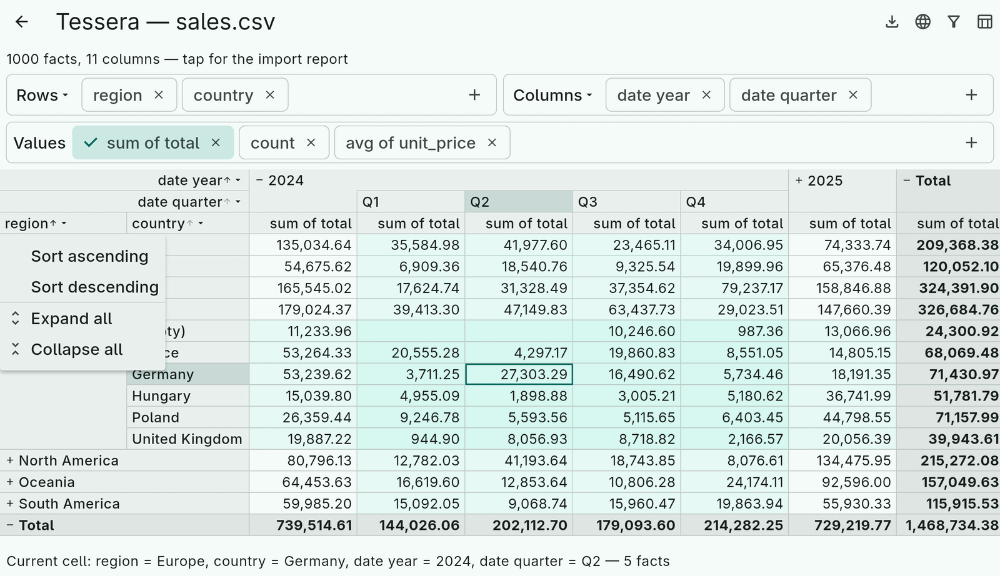
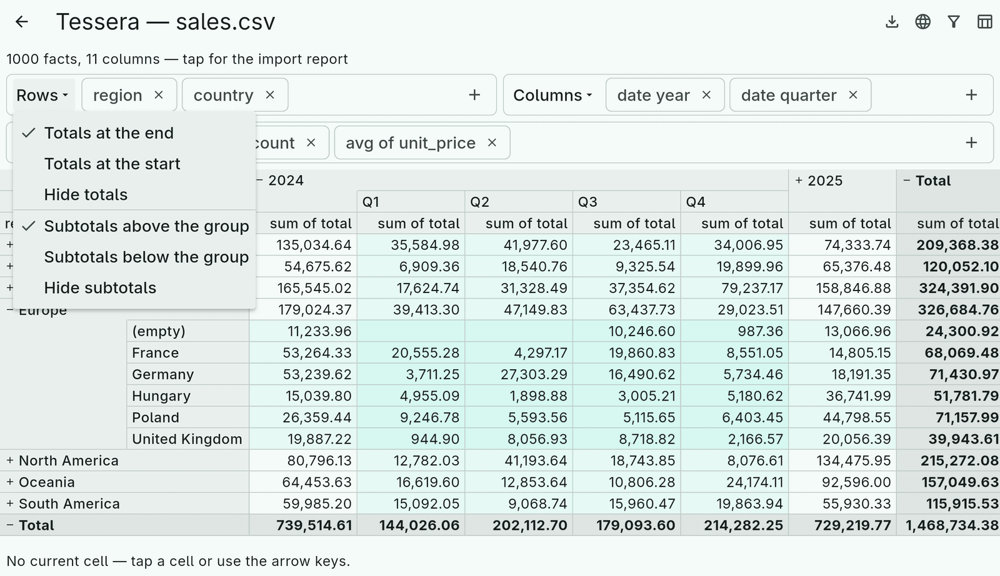
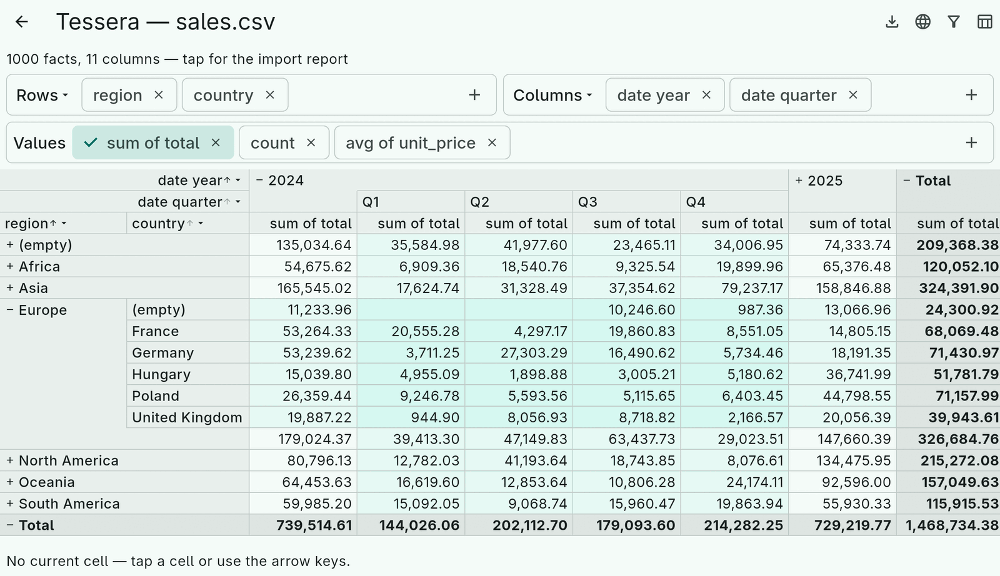

# 5. The cube

A `Cube` is three things: a `FactTable`, a `CubeSpec` saying what to
compute, and an `ExpansionState` per axis saying which groups are open.
It is immutable; every change gives you a new cube that shares the
expensive intermediate work with the old one. Its `layout` is computed
lazily and is what a renderer draws.

```dart
final cube = Cube(facts: facts, spec: spec);       // both axes: first level visible
final opened = cube
    .toggleRow(const DimensionPath([DimensionValue(region, 'Europe')]))
    .expandColumnsToDepth(2);
final layout = opened.layout;
```

## The spec

```dart
CubeSpec(
  rows: CubeAxis(
    dimensions: [
      AxisDimension(region, sort: const AxisSort(direction: SortDirection.descending)),
      AxisDimension(country),                        // sort: null → inherits region's
    ],
    summaryPosition: SummaryPosition.end,            // start, end, hidden
    subtotalPosition: SubtotalPosition.top,          // top, bottom, hidden
  ),
  columns: CubeAxis.of([year, quarter]),             // shorthand for default sorting
  aggregates: [Aggregate.sum(total), Aggregate.count],
  filter: ExpressionFilter('year(date) >= 2024'),
)
```

**Nesting order is the hierarchy.** `[region, country]` groups by region,
then by country within each region. There are no hierarchy declarations;
if countries belong to regions in the data, the tree reflects it.

`copyWith` produces an edited spec; `filter` takes a thunk so it can be
cleared: `spec.copyWith(filter: () => null)`.

## Expansion

An axis starts with its first level visible: the summary (the *root
path*) is expanded, nothing else. Expanding a group shows its children one
level down; an expanded group's own row stays and acts as the subtotal.
That is the outline model spreadsheets use, not separate subtotal rows.

```dart
cube.toggleRow(path);  cube.toggleColumn(path);       // one group
cube.expandRowsToDepth(2);                             // every group down to a level
cube.expandRowLevel(1);  cube.collapseRowLevel(1);     // one level, keeping deeper expansions
cube.rowsAddedByExpandingLevel(1);                     // how many rows that would add — ask first
```

A `DimensionPath` names a group: the list of (dimension, value) pairs
from the root. `DimensionPath.root` is the summary. Expansion states
carry paths, so a state survives a spec change that keeps the dimension
order, and paths that no longer fit are ignored.

The title menu of every dimension in the grid offers "Expand all" and
"Collapse all" for that level:



## Sorting

Each level has an `AxisSort`, or `null` to inherit the level above; the
first level's default is by value, ascending.

- **By value** (`SortBy.value`): the dimension's own ordering — text
  alphabetically, dates and date parts chronologically. `nulls` puts the
  empty group first or last.
- **By aggregate** (`SortBy.aggregate`): "regions by revenue". `keyPath`
  picks the cell on the *other* axis whose value is the key — sort rows by
  the 2024 column — and defaults to the summary. Groups with no value sort
  as the smallest.

```dart
AxisSort(by: SortBy.aggregate, aggregate: Aggregate.sum(total),
    keyPath: const DimensionPath([DimensionValue(year, 2024)]),
    direction: SortDirection.descending)
```

In the grid, tapping a dimension title toggles its direction; tapping an
aggregate name under a column sorts by that aggregate in that column, and
the sort-key column is tinted.

## Summaries and subtotals

Two independent settings per axis, like a spreadsheet's grand total and
subtotal options:

- `summaryPosition` puts the total row or column at the start, at the end
  (default) or hides it.
- `subtotalPosition` says where an expanded group's own row goes: above
  its children (the tree-grid look, default), below them (the classic
  "Europe … Europe total" report) or nowhere. A hidden subtotal is still
  computed — sorting by its value works — and its label still spans the
  children.

Both hidden on both axes gives a flat leaf table, handy for export.





## Reading the layout

`CubeLayout` is the visible grid: an `AxisLayout` per axis and a cell for
every intersection.

```dart
final rows = layout.rows;                 // AxisLayout
for (final entry in rows.entries) {       // HeaderEntry, in display order
  entry.path;  entry.depth;  entry.isSummary;
  entry.dimension;  entry.value;          // value is null for the empty group and the summary
  entry.isExpandable;  entry.isExpanded;  entry.childCount;  entry.factCount;
}
final cell = layout.cellAt(rowIndex, columnIndex);      // CubeCell
cell.aggregate(Aggregate.sum(total));                    // double? — null when nothing to show
cell.aggregates;                                         // every aggregate of the spec
cell.factCount;  cell.isEmpty;                           // an empty cell renders blank, not 0
cell.factRows;                                           // the fact indices behind it, lazily
layout.cellFor(rowPath, columnPath);                     // by path, null when not visible
```

`AxisGeometry` resolves the merged header areas (an expanded group's label
spanning its children) for renderers; `CubeGrid` lays the whole thing out
as a rectangular grid of typed cells, which is what every exporter draws
from. You need neither to read values.

## Missing values are groups, cells never store rows

Two rules run through the engine. A `null` dimension value is the
"(empty)" group, distinct from the summary; `sum` ignores nulls, `avg`
divides by the non-null count, `count` counts facts and `countNonNull`
counts values. And aggregation is one pass over the facts that feeds an
accumulator per visible cell; parents are merged from children, never
rescanned, and a cell only lists its rows when you ask. That is what
keeps millions of rows interactive.
