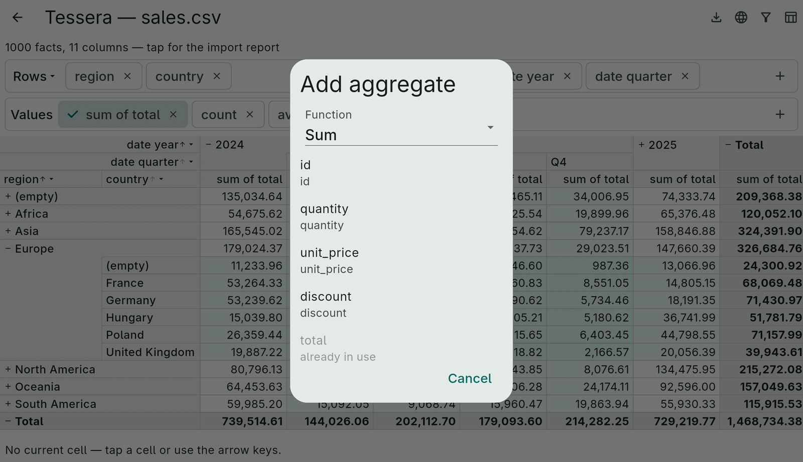
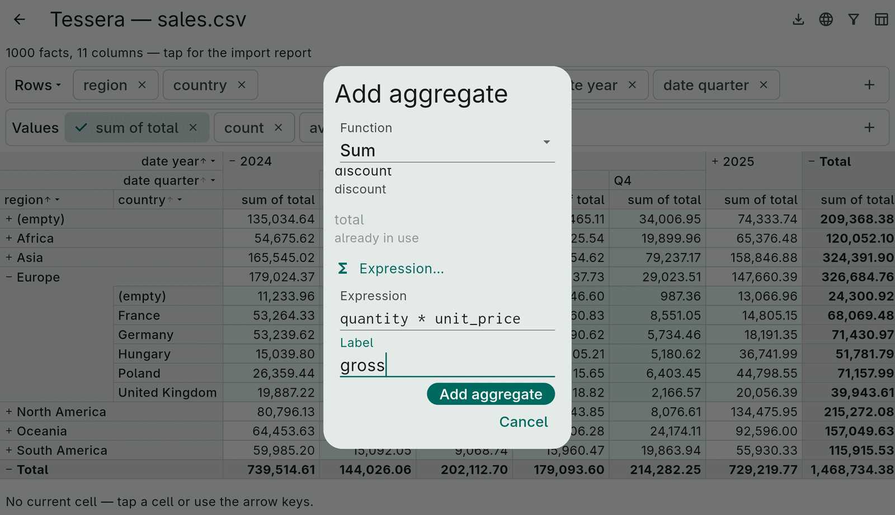
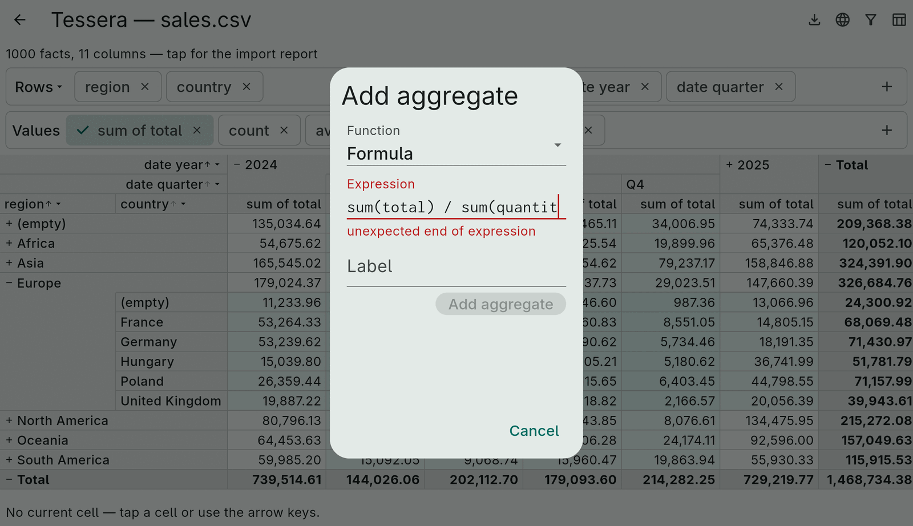
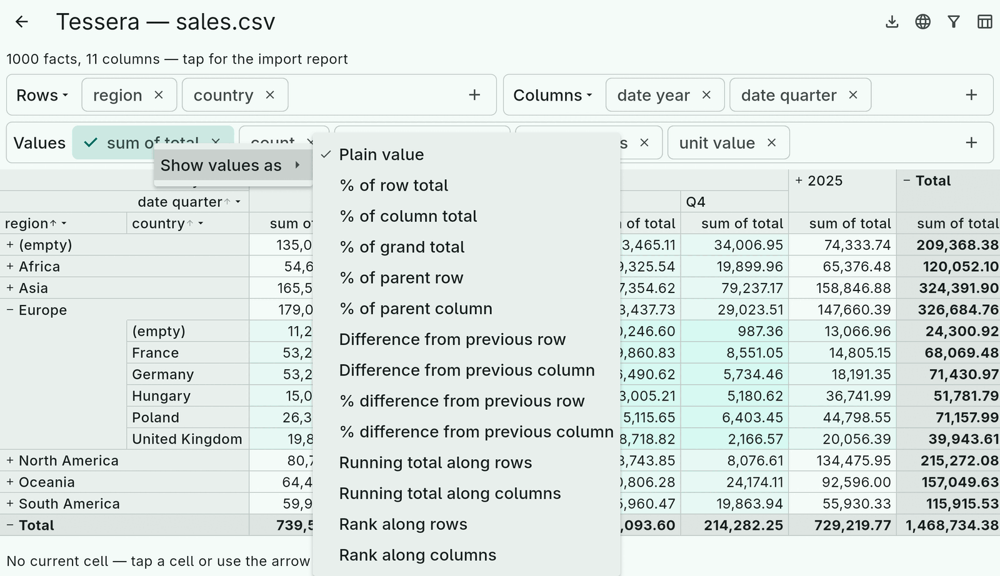
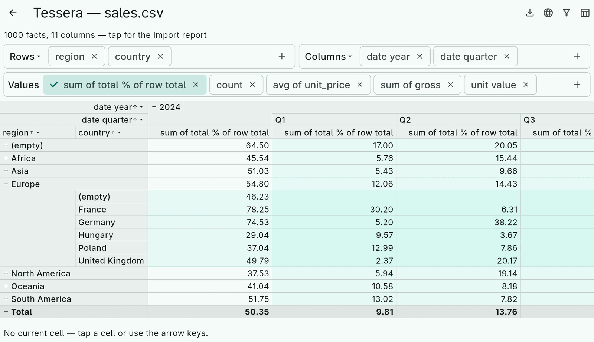

# 6. Aggregates

An `Aggregate` is what a cell shows. The spec lists them; the grid shows
one value column per aggregate under every column entry, and the
`AggregateEditor` lets the user pick which of them to display.

## Built in

```dart
Aggregate.sum(measure);        Aggregate.average(measure);
Aggregate.min(measure);        Aggregate.max(measure);
Aggregate.count;               // facts in the cell, never null
Aggregate.countNonNull(measure);
Aggregate.distinctCount(dimension);
Aggregate.stdDev(measure);     Aggregate.stdDevPopulation(measure);   // Excel's STDEV.S / STDEV.P
Aggregate.variance(measure);   Aggregate.variancePopulation(measure); // VAR.S / VAR.P
```

`sum`, `average`, `min`, `max` ignore missing values and give `null` when
a cell has none. The variance family is computed in one pass with
Welford's method and merged with Chan's formula, so parent cells are exact
and a mean of 10⁹ with a spread of 10 does not lose precision; sample
variants are `null` below two values.

`AggregateKind` enumerates these for pickers; `kind.build(measure:
…)` makes the aggregate.



## Calculated measures

Any measure function accepts a `Measure.expression`, a number computed per
fact — see the [expression chapter](08-expressions.md) for the language:

```dart
Aggregate.sum(Measure.expression('quantity * unit_price', label: 'gross'));
Aggregate.average(Measure.expression('total / quantity', label: 'unit value'));
```

In the picker, "Expression…" at the end of the measure list opens a
validated field for it:



## Cell formulas

`Aggregate.expression` is a formula over the *cell's* aggregates, evaluated
once per cell after accumulation:

```dart
Aggregate.expression('sum(total) / sum(quantity)', label: 'unit value');
Aggregate.expression('round(count(discount) / count * 100, 1)', label: '% discounted');
Aggregate.expression('stdevp(total) / avg(total)', label: 'CV');
```

The aggregate references are `sum(x)`, `avg(x)`, `min(x)`, `max(x)`,
`count` (facts), `count(x)` (non-empty values), `stdev(x)`, `stdevp(x)`,
`var(x)`, `varp(x)` and `distinct(x)`, where `x` is a column or any row
expression — `sum(quantity * unit_price) / sum(quantity)` is a weighted
average. The engine accumulates whatever the formula needs whether or not
the spec lists it. The result is `null` when a referenced aggregate is
`null` or a division by zero occurs.

The picker's "Formula" function offers the same, validated as you type:



## Show values as

Layout-relative aggregates present another aggregate's values against
the cells around them — a spreadsheet's "Show Values As":

```dart
final revenue = Aggregate.sum(const Measure('total'));
Aggregate.percentOf(revenue, TotalOf.row);              // also column, grand, parentRow, parentColumn
Aggregate.differenceFrom(revenue, axis: AxisSide.columns);           // from the previous column group
Aggregate.differenceFrom(revenue, axis: AxisSide.rows, item: const BaseItem.value('Europe'));
Aggregate.percentDifferenceFrom(revenue, axis: AxisSide.columns, item: BaseItem.next);
Aggregate.runningTotal(revenue, axis: AxisSide.columns);
Aggregate.rank(revenue, axis: AxisSide.rows);           // 1 = largest; ascending: true for smallest
```

They are computed from the layout when a cell is read, so they follow
expansion and sorting. "Previous", "next", running totals and ranks work
among the siblings of the cell's own group in display order; summaries
have no siblings and give `null`. Percent of a missing or zero total is
`null`. Sorting by a layout aggregate sorts by the aggregate it is applied
to.

In the editor, a long press or right click on an aggregate chip opens the
menu; the `ValueDisplay` enum names the same choices for your own UI:





## Your own

Three base classes, from cheapest to most flexible:

- **`Aggregate` + `AggregateAccumulator`**: something accumulated over
  facts. Implement `add(facts, row)`, `merge(other)` and `result`; parents
  merge children, so carry what merging needs (an average carries sum and
  count).
- **`DerivedAggregate`**: computed per cell from other aggregates'
  results. List the `dependencies`, implement `compute(resultOf)`.
- **`LayoutAggregate`**: computed per cell with access to the cells
  around it through a `LayoutCellContext` (`value`, `total`, `sibling`,
  `siblings`).

Custom aggregates need a `JsonAdapter` to be [saved](13-saving.md) and a
label through `labelFor`; the localized composition applies to the
built-in ones only.
