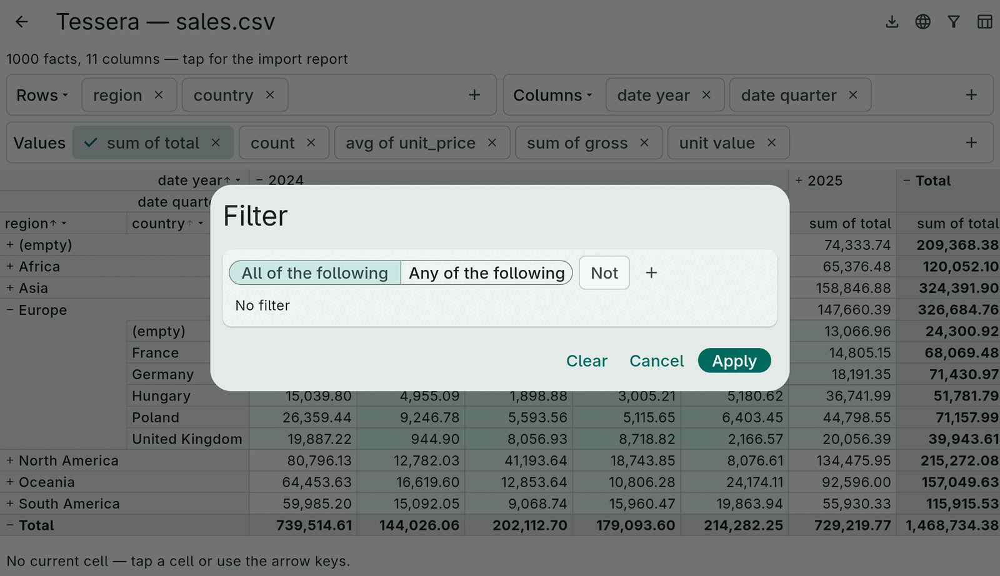
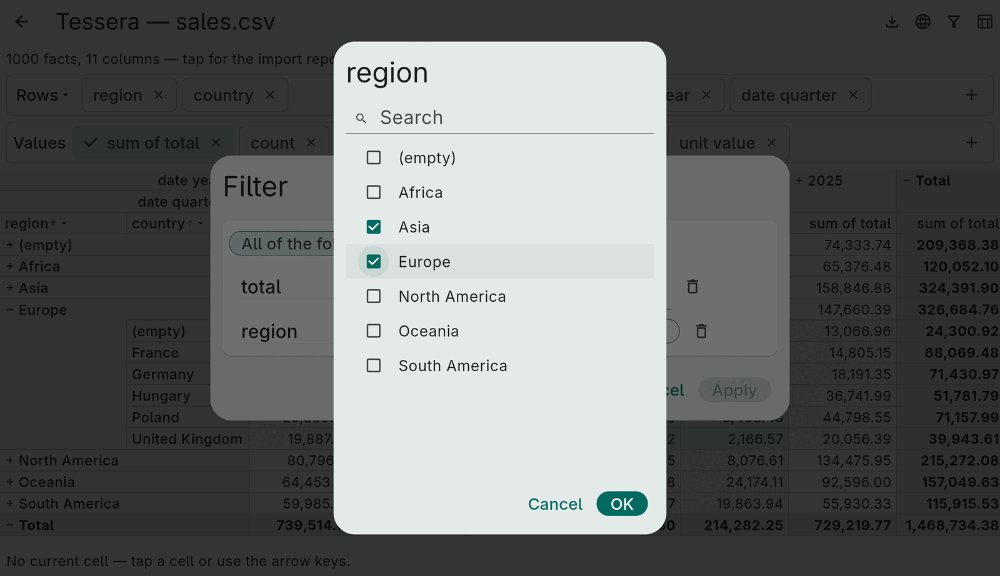
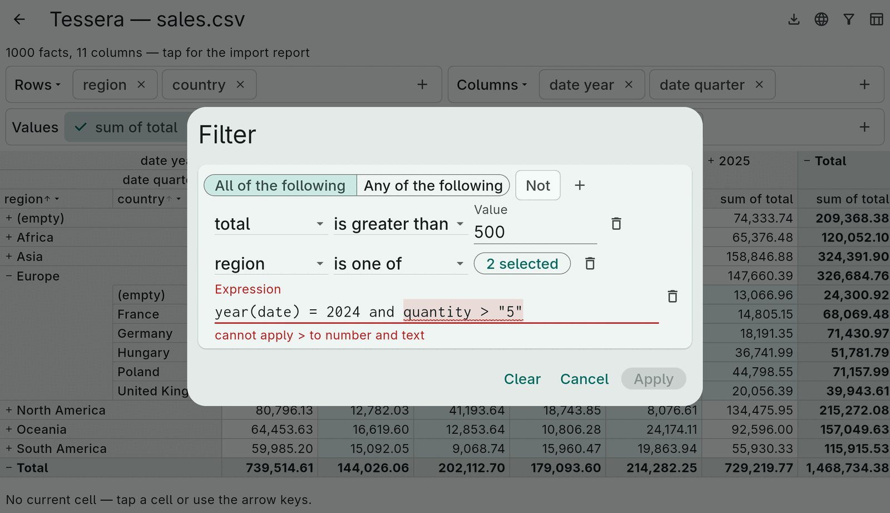
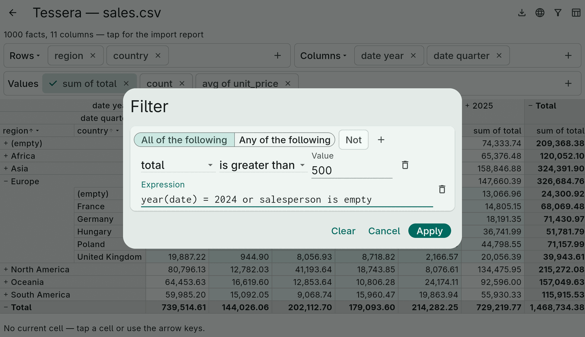
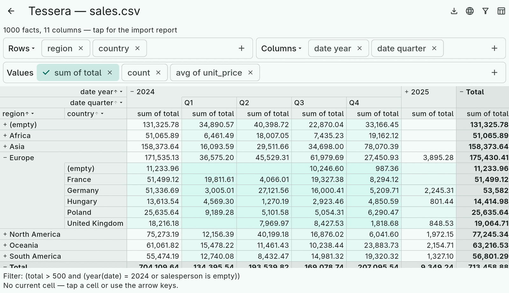

# 7. Filters

A `FactFilter` restricts which facts a cube sees, independently of the
axes — the "filter area" of a pivot table: `year = 2024` without the year
appearing in a header. It lives on `CubeSpec.filter`; the filtered row
list is cached per cube, so the scan runs once per filter change.

## Structured filters

Plain data, equal by value, serializable, and what the filter editor's
builder produces:

```dart
CompareFilter('total', CompareOp.greater, 500);           // = <> < <= > >= against a number, text, bool or DateTime
RangeFilter('date', DateTime.utc(2024), DateTime.utc(2024, 12, 31));   // inclusive
TextFilter('country', TextMatch.startsWith, 'G');         // contains, startsWith, endsWith; case-sensitive
EmptyFilter('discount');  EmptyFilter('discount', negated: true);
ValueFilter(const ColumnDimension('region'), {'Europe', 'Asia', null});   // "is one of"; null = the empty group
AndFilter([...]);  OrFilter([...]);  NotFilter(f);
```

A `ValueFilter` takes any dimension, so `ValueFilter(DatePartDimension('date',
DatePart.year), {2024})` is the year filter.

## Expression filters

Anything the builder cannot say, in the [expression language](08-expressions.md):

```dart
ExpressionFilter('total > 500 and (year(date) = 2024 or salesperson is empty)');
```

The expression must be boolean; a fact is kept when it is *true* — an
unknown result (a comparison with an empty value) excludes the fact, as
in SQL. The filter compiles against the fact table the first time it is
used; validate earlier with `Expression.validate(source, scope:
ExpressionScope.ofFacts(facts), expected: ExprType.boolean)`.

Every filter renders itself as an expression with `toExpressionSource()`
— `(total > 500 and region in ("Asia", "Europe"))` — which is how the
demo app shows the active filter under the grid and how a structured
tree becomes text for a power user to edit.

## Predicates

`PredicateFilter((facts, row) => …)` wraps a Dart function. It cannot be
saved, rendered as text or edited; the editor shows it as a read-only row
that can only be removed. Use it for conditions that depend on state
outside the data.

## The filter editor

`showFilterEditor(context, facts: facts, initial: spec.filter)` opens a
dialog and returns the applied filter (or `null` for "dismissed"; a
result whose filter is `null` means "cleared"). `FilterEditor` is the
same thing as an inline widget with an `onChanged` callback.



A group combines its rows with *all of* or *any of* and can be negated.
The `+` adds a condition (column, operator, value), a nested group, or an
expression row. Operators depend on the column type — text gets contains
/ starts with / ends with / is one of, numbers and dates get the
comparisons and between, booleans get is true / is false — and the value
field matches: a number field, a date field with a picker, or for "is
one of" a searchable list of the column's distinct values:



Expression rows are validated on every keystroke, with the offending
range underlined and the message in the current language:





Apply is disabled while any row is incomplete or invalid. The result is a
`FactFilter` tree the app puts on the spec:

```dart
final result = await showFilterEditor(context, facts: cube.facts, initial: spec.filter);
if (result != null) controller.updateSpec(spec.copyWith(filter: () => result.filter));
```


