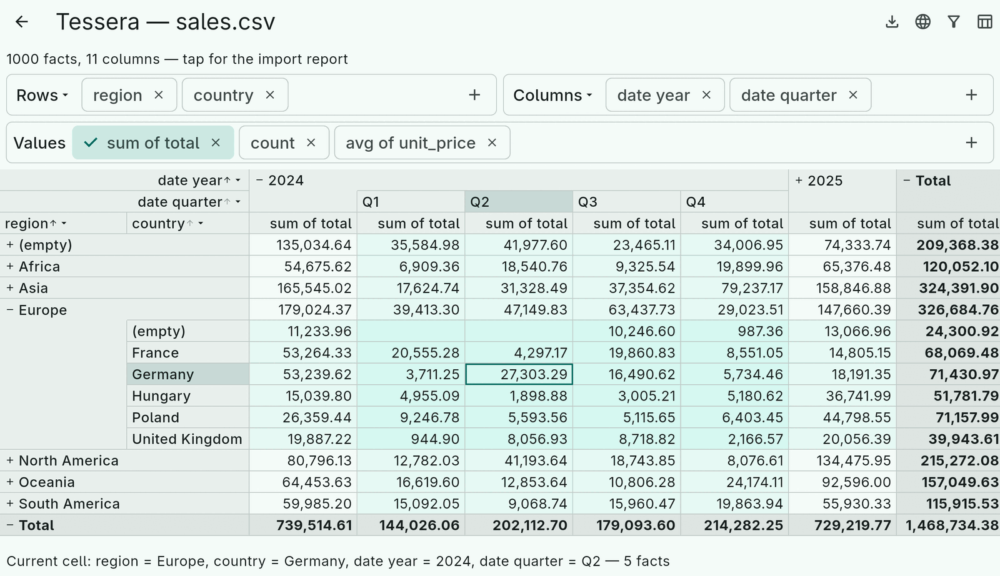
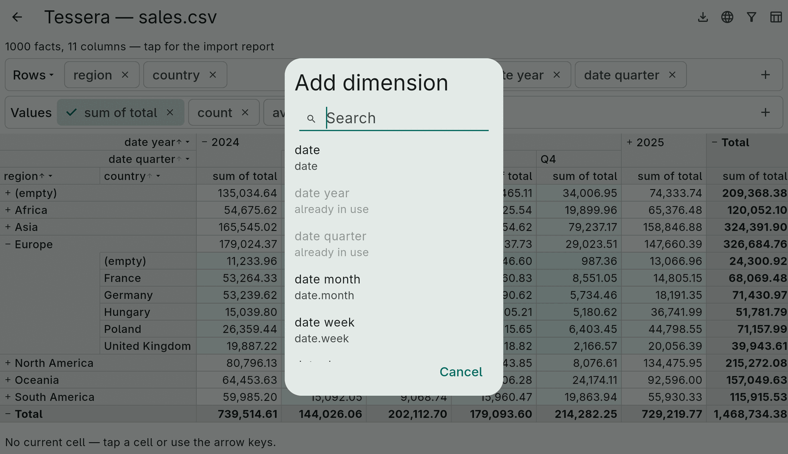
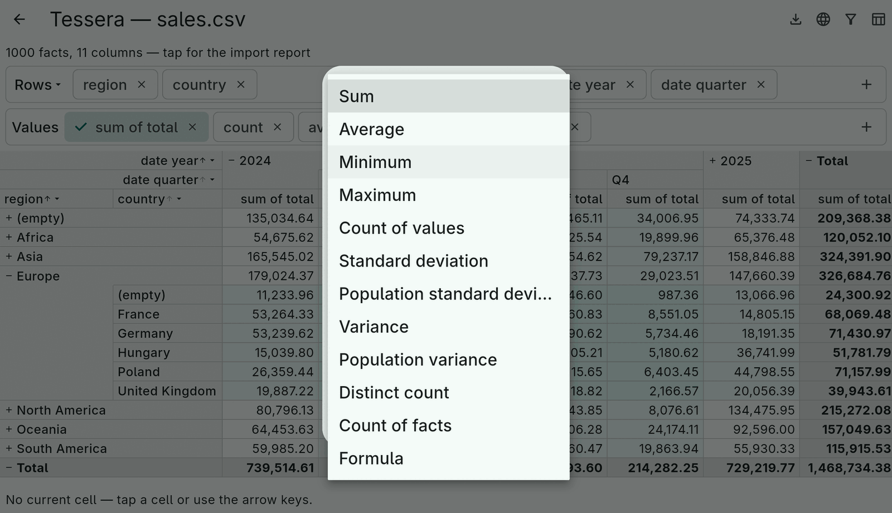

# 9. The widgets

`tessera_flutter` adds four widgets, three dialogs and a controller on top
of the engine. They compose freely; the demo app's `CubeWorkbench`
(`example/lib/common/workbench.dart`) is one arrangement of them.



## CubeController

The single mutable object. It holds the current `Cube`, applies changes
and notifies listeners; every widget reads from it and writes back to it.

```dart
final controller = CubeController(Cube(facts: facts, spec: spec));
controller.cube;                          // the current cube (and its layout)
controller.cube = other;                  // replace it wholesale (new facts, restored config)
controller.updateSpec(spec.copyWith(...));
controller.toggleRow(path);  controller.expandRowLevel(1);  // and the column twins
controller.selection;  controller.currentCell;              // the current cell, see below
controller.addListener(() { /* re-render, persist, chart */ });
```

Replacing the cube keeps nothing; `updateSpec` keeps the expansion state
where the paths still fit.

## CubeView

The grid, built on `TableView` from `two_dimensional_scrollables`: lazy
cells, pinned header band and row headers, merged group labels, expand
and collapse icons, sort by tapping, a dimension menu on every title.

```dart
CubeView(
  controller: controller,
  aggregates: [sumTotal, Aggregate.count],   // which of the spec's aggregates to show; null = all
  formatCell: (cell, value) => value is num ? money.format(value) : '$value',
  styleCell: (cell, value) => value is num && value < 0 ? negative : null,
  expansionLimit: 200,                       // ask before adding more rows/columns than this
  onCellTap: (cell) => ...,
)
```

- **Aggregates.** One value column per shown aggregate under every column
  entry; the aggregate label row names them and tapping a name sorts by
  that aggregate in that column.
- **Widths** are content-sized from the first `measuredRows` rows and the
  labels, clamped to the theme's minimum and maximum; a column never
  shrinks while the widget lives (`keepColumnWidths`), so toggling a
  group does not make the grid jump.
- **Large expansions.** Expanding a group or a level that would add more
  than `expansionLimit` rows or columns asks first; `confirmExpansion` and
  `confirmLevelExpansion` replace the default dialog.
- **Labels.** `emptyGroupLabel`, `rowSummaryLabel`, `columnSummaryLabel`
  override the localized "(empty)" and "Total".

### The current cell

With `selectable` (default), tapping a cell or moving with the keyboard
makes it the current cell: an outline in `CubeTheme.selectionColor`, its
row and column headers tinted. `controller.selection` is a `CellAddress`
(row path, column path, aggregate) that survives when the cell scrolls
out of view or collapses; `controller.currentCell` resolves it against
the layout, `null` when not visible. The demo prints the coordinate and
fact count under the grid — the hook for a chart or a drill-through.

Keyboard, once the grid has focus (tap a cell, or `autofocus`):

| Keys | Action |
|---|---|
| Arrows | Move one cell; left and right walk value columns |
| Home / End | First / last column; with Ctrl, first / last row |
| Page Up / Page Down | One page of rows |
| Enter / Space | Toggle the row group |
| Escape | Clear the selection |

The number block works without NumLock.

## AxisEditor and the dimension picker

One `AxisEditor` per axis: a chip per dimension, drag and drop within
and between the two editors, a delete icon, and `+` for the picker. The
caption ("Rows", "Columns") is a menu for the summary and subtotal
positions.

```dart
AxisEditor(controller: controller, side: AxisSide.rows);
AxisEditor(controller: controller, side: AxisSide.columns,
    available: standardDimensions(facts).where(...).toList());   // what the picker offers
```

`showDimensionPicker` is a searchable dialog over `standardDimensions(facts)`
with the dimensions already in use disabled:



## AggregateEditor and the aggregate picker

A chip per aggregate; the delete icon removes one (never the last; a sort
that used it falls back to sorting by value); `+` opens the picker. With
`selected` and `onSelectedChanged` the chips toggle which aggregates the
`CubeView` shows, in the spec's order, never below one:

```dart
AggregateEditor(
  controller: controller,
  selected: shown.toSet(),
  onSelectedChanged: (list) => setState(() => shown = list),
  functions: myFunctions,                  // for expressions in the picker
)
```

`showAggregatePicker` offers every `AggregateKind` over the numeric
columns (and, for distinct count, every dimension), a "Formula" function
for cell formulas, and an "Expression…" entry under every measure
function for calculated measures; the [aggregates chapter](06-aggregates.md)
shows them. A long press or secondary click on a chip opens "Show values
as".



## FilterEditor

Covered in the [filters chapter](07-filters.md): `showFilterEditor` for
a dialog, `FilterEditor` inline.

## ExpressionField

A text field for an expression, validated on every keystroke in a given
scope, the error range underlined by `ExpressionTextController` and the
message shown in the current language. The filter editor and the
aggregate picker use it; so can you:

```dart
ExpressionField(
  scope: ExpressionScope.ofFacts(facts),
  expected: ExprType.boolean,
  initialValue: current,
  onChanged: (v) => setState(() { text = v.source; valid = v.isValid; }),
)
```

## Putting it together

The demo's `CubeWorkbench` does the whole flow: infer the schema, import
in an isolate with a progress bar, keep the schema editable, compose the
editors and the grid, show the current cell, and offer export. Its
`initialSpec`, `dimensions`, `adjustSchema`, `theme` and `actions`
parameters are how the three example pages customize it — a reasonable
template for an app's pivot screen.
