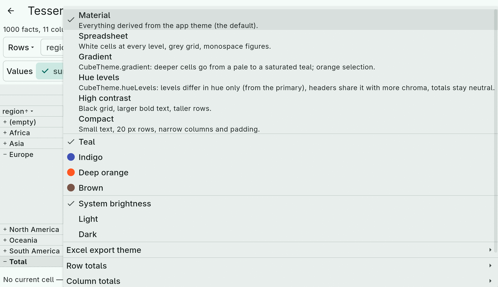
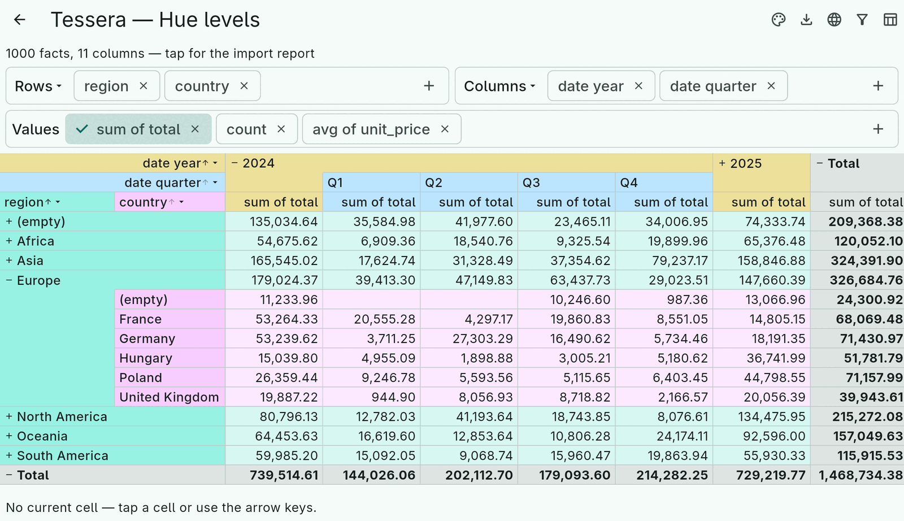
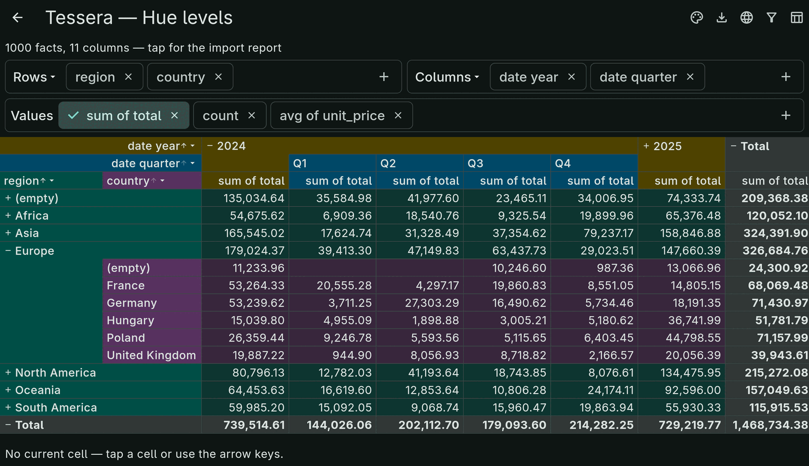
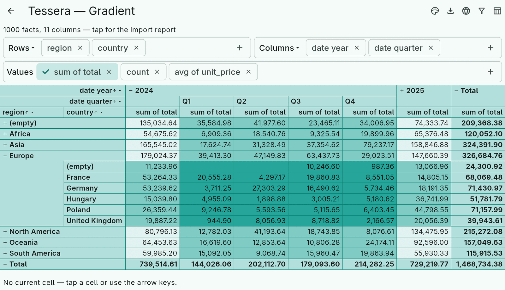
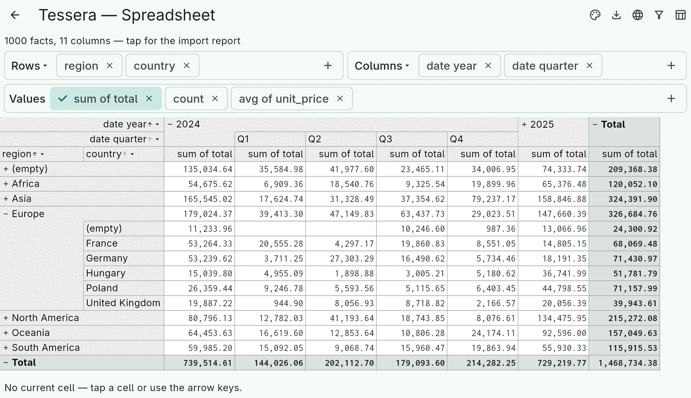
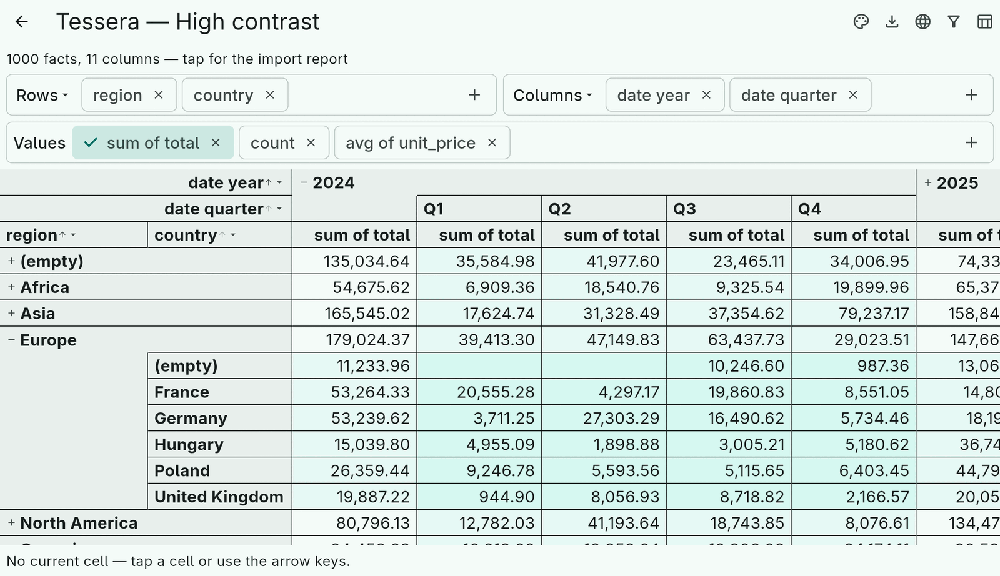
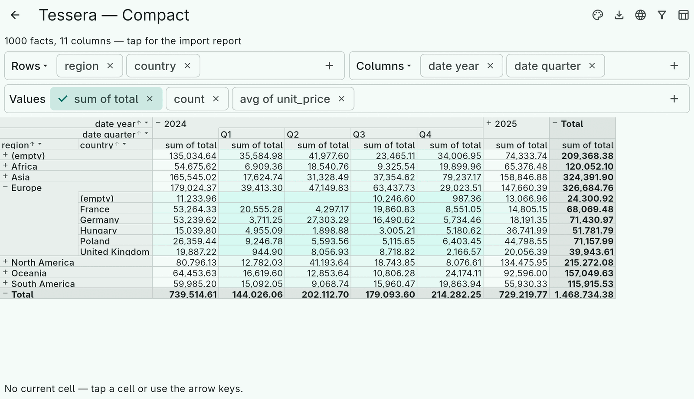

# 10. Theming

`CubeView` takes a `CubeTheme`. Every colour and style in it is optional;
what you leave unset is derived from the ambient Material `ThemeData`
when the view is built, so the default grid follows the app's colour
scheme and light or dark mode with no configuration at all.

```dart
CubeView(
  controller: controller,
  theme: CubeTheme(
    headerColor: scheme.surfaceContainerHighest,
    summaryColor: scheme.surfaceContainer,
    selectionColor: Colors.deepOrange,
    sortKeyColor: scheme.tertiaryContainer,
    borderColor: scheme.outlineVariant,
    cellTextStyle: const TextStyle(fontFamily: 'monospace'),
    headerTextStyle: textTheme.labelLarge,
    rowHeight: 24, headerRowHeight: 28,
    minColumnWidth: 72, maxColumnWidth: 320,
    minRowHeaderWidth: 100, maxRowHeaderWidth: 400,
    cellPadding: const EdgeInsets.symmetric(horizontal: 6),
  ),
)
```

Equal minimum and maximum widths give fixed columns.

## Level colours

Data cells are shaded by nesting depth so the eye can tell a subtotal
row from a leaf. Three ways to say how:

- **Default**: a blend from the surface colour towards the primary
  container, deeper is stronger.
- **`levelColor`**: a function of `CellLevel` (`row` and `column` depth,
  `depth` = their sum, `maxDepth`). `CubeTheme.gradient([...])` builds
  one from a list of colours by depth:

  ```dart
  CubeTheme(levelColor: CubeTheme.gradient([Colors.white, Colors.teal.shade50, Colors.teal.shade100]))
  ```

- **`hueLevels`**: levels differ in *hue* only, at one lightness, so no
  level looks "more important" than another — the owner's answer to the
  complaint that darker shading reads as highlighting. Row levels take the
  first hues, column levels continue after them, a data cell takes its row
  level's hue, headers share the hue with more chroma, summaries stay
  neutral. `HueLevels()` derives the start hue from the primary colour and
  steps by the golden angle, so adding a level never changes the others;
  `hue`, `step`, `lightness`, `chroma` and the header variants are all
  adjustable. Computed in OKLCH (`Oklch`) so the equal-lightness promise
  holds perceptually.

Header cells use `headerColor`, or `headerLevelColor` for a colour per
header level; `headerIconColor` defaults to the header text colour.

## The presets

The Theming example (`example/lib/theming/presets.dart`) is the place to
see the options side by side. Its palette menu switches presets, seed
colours and brightness:



| Preset | What it shows |
|---|---|
| Material | Everything derived from the app theme (the default). |
| Spreadsheet | White cells at every level, grey grid, monospace figures. |
| Gradient | `CubeTheme.gradient`: deeper cells from a pale to a saturated teal; orange selection. |
| Hue levels | `CubeTheme(hueLevels: HueLevels())`. |
| High contrast | Black grid, larger bold text, taller rows. |
| Compact | Small text, 20 px rows, narrow columns and padding. |













Every preset resolves in light and dark; `test/theming_test.dart` in the
example checks that, and is a good pattern for your own themes.

## Per-cell styling

Theme colours are per level. For per-value styling — negatives in red,
zeros dimmed — use `CubeView.styleCell`, which returns a `TextStyle` for
a cell and its value, and `formatCell` for the text itself.

## Export themes

Screen shading is too subtle for paper, so exporters do not convert a
`CubeTheme`; they take a `CubeExportTheme`, authored separately. The
[export chapter](11-export.md) covers it; the Theming example pairs each
preset with one.
