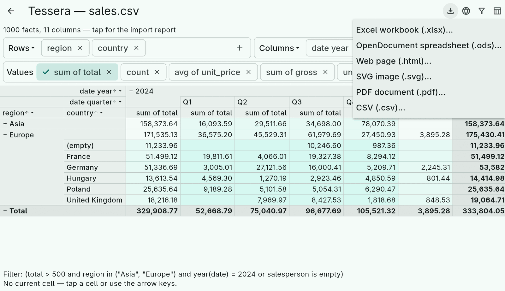
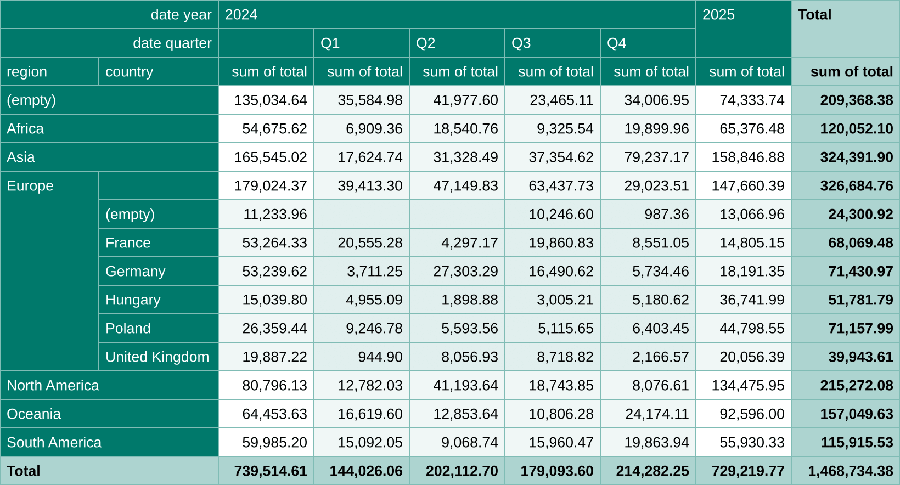
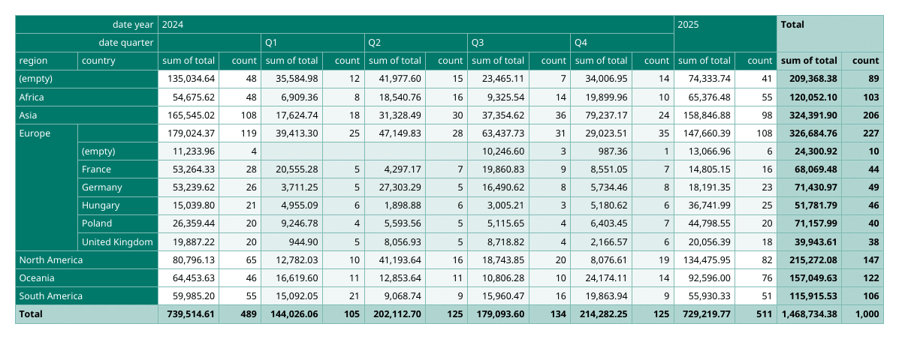

# 11. Export

Every exporter renders a `CubeLayout` — what the grid shows, including
which groups are expanded — without Flutter. The engine has CSV; the
other formats are packages of their own so that an app pulls in only the
dependencies it uses.

| Format | Package | Call | Returns |
|---|---|---|---|
| CSV | `tessera` | `CsvCubeExporter().export(layout)` / `writeTo(sink, layout)` | `String` |
| JSON, JSON Lines | `tessera` | `JsonCubeExporter().export(layout)` / `exportLines(layout)` / `records(layout)` | `String` / `List<Map>` |
| XLSX | `tessera_xlsx` | `XlsxCubeExporter().export(layout)` | `Uint8List` |
| ODS | `tessera_ods` | `OdsCubeExporter().export(layout)` | `Uint8List` |
| HTML | `tessera_html` | `HtmlCubeExporter().export(layout)` | `String` |
| SVG | `tessera_svg` | `SvgCubeExporter().export(layout)` | `String` |
| PDF | `tessera_pdf` | `await PdfCubeExporter().export(layout)` | `Future<Uint8List>` |

All take `aggregates:` to export a subset of the spec's aggregates (the
same list the `CubeView` shows), `strings:` for the language of the
labels (default English) and the `emptyGroupLabel` / summary label
overrides. Writing the bytes to a file, sharing them or sending them in
a response is the app's business; the demo uses `file_picker`'s save
dialog, which is what works on every platform including Android and iOS.

```dart
final theme = CubeExportTheme.brand(primary: 0xFF00796B);
final xlsx = XlsxCubeExporter(theme: theme, strings: const TesseraStringsDe())
    .export(controller.cube.layout, aggregates: shown, sheetName: 'Sales');
```



## The shared look: CubeExportTheme

One format-neutral description of how an exported cube looks, as plain
integers (ARGB colours, point sizes) so it works without Flutter:

- `headerFill`, `summaryFill`, `borderColor`;
- `levelFills`, one colour per nesting level (`levelBasis` says whether
  a level is row depth + column depth, or row depth only),
  `rowHeaderFills` / `columnHeaderFills` per level;
- `cellFont`, `headerFont`, `summaryFont` (`ExportFont`: family, size,
  bold, italic, colour);
- `numberFormat` (`NumberFormat`: decimals, grouping).

Two factories cover most needs: `CubeExportTheme.brand(primary:)` tints
everything from one colour, `CubeExportTheme.hueLevels()` is the
[hue-levels](10-theming.md) look for paper. `gradient` and `mix` build
your own fill lists.

## Format notes

**CSV** writes the grid as cells. `CsvExportOptions` sets the delimiter,
quote, line ending, decimal separator, a byte order mark (Excel wants one
for UTF-8), and `groupLabels`: `origin` writes a group label once, where
the sheet shows it; `repeat` fills it down every row so other tools can
pivot on the result. `europeanExcel` is the preset for a semicolon file
with a comma decimal.

**JSON and JSON Lines** write the grid as records: one object per grid
row, the row dimensions as fields named after their titles, and one field
per column entry and aggregate named from the column labels and the
aggregate name — `"2024 / Q1 / sum of total": 35584.98`. Numbers are
numbers, blanks are `null`, dates are ISO text. A row group's label
repeats in every record of the group by default, so each record stands on
its own (`JsonExportOptions.groupLabels` switches to once per group);
`pathSeparator` and `indent` are the other knobs. `export` gives the
array, `exportLines` one record per line, `records` the objects for your
own processing. The JSON Lines output is exactly what `JsonlDataSource`
reads, so a cube can be re-imported as a table.

**XLSX and ODS** write one formatted sheet: merged header areas, fills
and fonts from the theme, thin borders, frozen headers
(`freezeHeaders`), column widths from the content clamped to
`minColumnWidth` / `maxColumnWidth`, and real numbers with a number
format (`numberFormatCode` for a custom Excel code). Both packages use
their own OOXML and OpenDocument writers on `archive` and `xml`. The
demo app's "Excel export theme" submenu picks the theme for these two.

**HTML** writes a `<table>` with `<thead>`, `rowspan` / `colspan` from
the merged areas, `scope` on the header cells and a class per role and
level (`tessera-header`, `tessera-level-2`, `tessera-num`, …).
`HtmlStyling.stylesheet` puts a `<style>` from the theme in the page with
sticky headers; `.inline` writes style attributes, for e-mail; `.none`
leaves styling to you. `standalone: false` gives the table alone.

**SVG** draws one image: a `<rect>` and a `<text>` per cell, content-sized
columns from the engine's `GridMetrics` (an estimate per character
class; pass `measureText` for exact widths from your font), text clipped
per cell. The result scales to any size.



**PDF** paginates: frozen header rows and columns repeat on every page,
cuts fall on whole rows and columns, pages run down then across.
`fitToWidth` (default) scales down to `minScale` (0.6) before tiling.
`PageSetup` is the paper (`PageSize` A3/A4/A5/letter/legal/custom,
orientation, margins in mm; default A4 landscape); `PdfFonts` embeds
TrueType files — needed for anything outside Latin-1, the built-in
Helvetica covers WinAnsi only; `PdfPageText` header and footer take
`{title}`, `{page}`, `{pages}` and `{date}`. `plan(layout)` returns the
scale and page count without rendering, for a preview.



## Under the hood

`CubeGrid.of(layout)` turns a layout into a rectangular grid of `GridCell`s
with a kind (title, header, aggregate name, data, summary), value, level
and merge span; `AxisGeometry` is where the merged areas come from;
`GridMetrics` adds pixel sizes and `GridPagination` page cuts. An
exporter for another format is a walk over that grid — the six existing
ones are between 150 and 450 lines each (the xlsx one shares its OOXML
writer with the reader).
