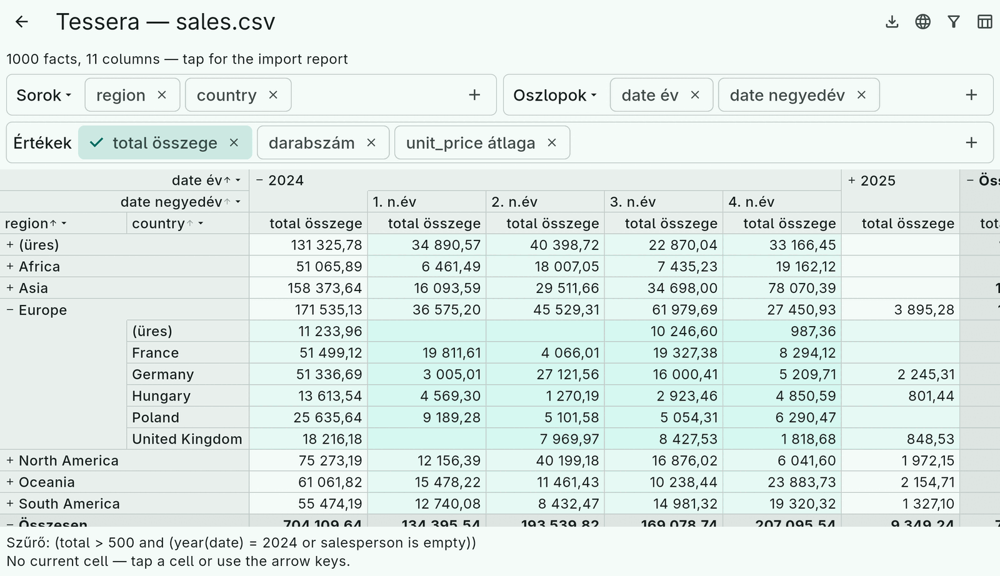

# 12. Localization

Every user-facing text of Tessera — header labels, "(empty)" and "Total",
month and weekday names, the widgets' chrome, the filter editor's
operators, expression error messages — comes from a `TesseraStrings`
object. Fourteen languages are built in: English, Hungarian, German,
French, Spanish, Italian, Portuguese, Dutch, Polish, Czech, Russian,
Turkish, Chinese and Japanese.



The library does not depend on `intl`. Labels are *composed* per
language rather than concatenated, because inflected languages put the
words in a different order: "sum of total" is "total összege" in
Hungarian and "Summe von total" in German. Numbers use the language's
decimal and group separators.

## In the engine

`TesseraStrings.forLanguage('hu')` returns the built-in strings for a
language code, `TesseraStrings.supportedLanguages` lists the codes. The
exporters take a `strings:` parameter, so a server can write a German
workbook:

```dart
XlsxCubeExporter(strings: const TesseraStringsDe()).export(layout);
```

The composition rules are methods: `aggregateLabel(aggregate, facts)`,
`dimensionLabel(dimension, facts)`, `formatValue(dimension, value)` for a
group header (month names, `Q1`, weekday names), `formatNumber(value)`,
`expressionError(error)`. A label you give explicitly to a dimension,
measure or aggregate is used as is in every language.

## In Flutter

Register the delegate and the supported locales in your `MaterialApp`,
alongside Flutter's own:

```dart
MaterialApp(
  localizationsDelegates: const [
    TesseraLocalizations.delegate,
    GlobalMaterialLocalizations.delegate,
    GlobalWidgetsLocalizations.delegate,
    GlobalCupertinoLocalizations.delegate,
  ],
  supportedLocales: TesseraLocalizations.supportedLocales,
  locale: chosenLocale,          // or leave it to the system
)
```

Widgets resolve their texts with `TesseraLocalizations.of(context)`.
Without a delegate they fall back to English; the delegate matches on
the language code, so `de_AT` gets German. To bypass the delegate — an
app with its own language switch, or a language of its own — wrap the
tree in a `TesseraLocalizationsScope(strings: …)` above the
`MaterialApp` (or in its `builder`) so dialogs see it too.

Widget parameters such as `emptyGroupLabel`, `label` or `addTooltip`
override individual texts.

## Adding a language

`TesseraStrings` is abstract with every member abstract, so a new
locale is complete by construction: the compiler lists what is missing.
Subclass it, or subclass `TesseraStringsEn` and override what differs,
and provide it through a `TesseraLocalizationsScope` or your own
delegate. Contributions of new languages, and native review of the
existing ones, are welcome in the repository.
