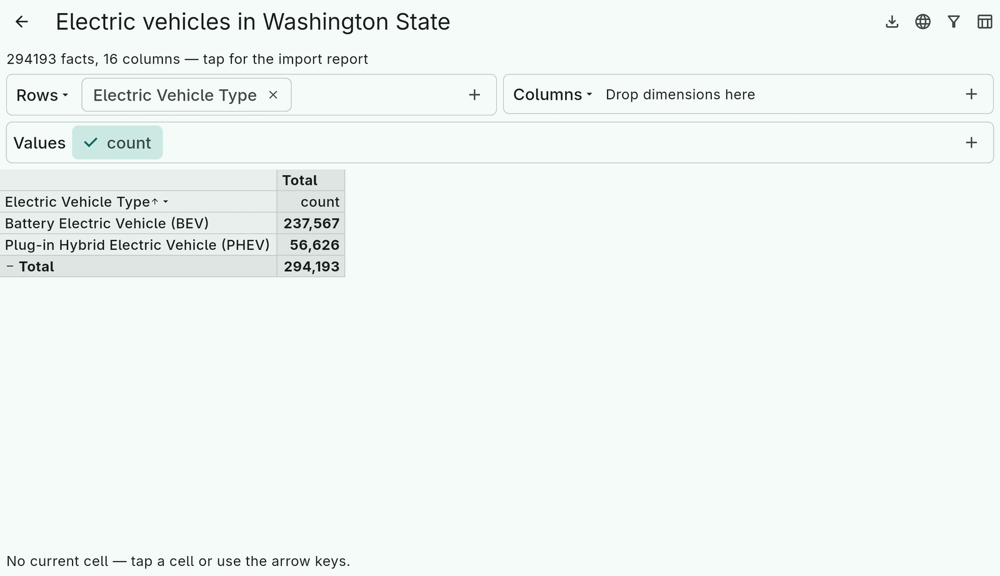

# 14. Large data

Tessera keeps the whole fact table in memory and is built to make that
fine for millions of rows. Measured on the 2 M-row, 172 MB version of
the sales file (a desktop, Dart JIT; AOT is about the same):

| Step | Time |
|---|---|
| Parse the CSV | 2.3 s |
| Import (typed, dictionary-encoded columns) | 5.5 s |
| First cube (dimension codes + layout) | 1.1 s |
| Expand every group of both axes | 0.4 s |
| Toggle a group | 0.3 s |
| An expression filter, measure or dimension, first use | 0.2–0.4 s, then cached |
| Snapshot encode / decode | 40 ms / 60 ms |
| Memory | ~400 MB resident |

`packages/tessera_flutter/example/tool/bench.dart` reproduces the
numbers; `tool/gen_sales_csv.dart --rows 2000000 --out big.csv`
generates the file.

## Keep the UI responsive

Parsing and importing block the thread they run on. `loadFactsInIsolate`
runs inference and import in a worker isolate and forwards progress:

```dart
final result = await loadFactsInIsolate(
  source,
  schema: editedSchema,                 // optional
  onProgress: (p) {
    setState(() => progress = p);       // p.rowsRead, p.estimatedTotal, p.fraction, p.done
    return !cancelled;                  // false cancels → ImportCancelled
  },
);
```

- The source is sent to the isolate, so it must be sendable: plain data
  such as `CsvDataSource.fromData(bytes)`, a `File`-backed source, the
  demo's `HttpCsvDataSource`. A live stream, or a `fromBytes` callback
  written inside a `State` (it captures `this`), is not.
- `ImportProgress.fraction` is `rowsRead / estimatedTotal`, capped at
  0.99 until `done`; the estimate comes from `DataSource.estimatedRowCount`
  (exact for lists; for CSV the file length divided by the average size
  of the first 200 records, which needs `length:` on `fromBytes`).
- The importer yields to the event loop at every report
  (`progressEvery`, default 10 000 rows), so cancellation is prompt.
- On the web there are no isolates; the call falls back to `loadFacts`
  on the main thread.

The cube itself is computed on the calling thread. At 0.3 s per toggle
on 2 M rows that is acceptable for a desktop; for a very large table on a
slow device, compute the layout off the UI thread and hand the cube to
the controller.



## Reduce what the user waits for

- **Snapshots.** Write `TesseraSnapshot.encode(facts)` next to the source
  after the first import and read it on the next open: 60 ms instead of
  8 s. A server can do the import once for every client
  ([saving chapter](13-saving.md)).
- **Expansion limits.** `CubeView.expansionLimit` asks before an
  expansion that would add more than 200 rows or columns;
  `rowsAddedByExpandingLevel` lets your own UI ask the same question.
- **Filters first.** A filter is one pass over the facts and is cached
  per cube, so a cube over a filtered table costs no more than an
  unfiltered one.
- **Measure widths.** `CubeView.measuredRows` (default 1000) bounds the
  rows whose values are laid out to size columns.

## Limits to know

- Everything lives in memory; the fact table of the 2 M-row file is
  about 100 MB, the cube's working set adds to it.
- The xlsx and ods readers hold the decompressed sheet XML in memory;
  CSV streams. Convert very large sheets to CSV first.
- A `MappedDimension` calls its function once per fact when the
  dimension is first used (the codes are cached with the cube); an
  `ExpressionDimension` is materialized once per fact table.
