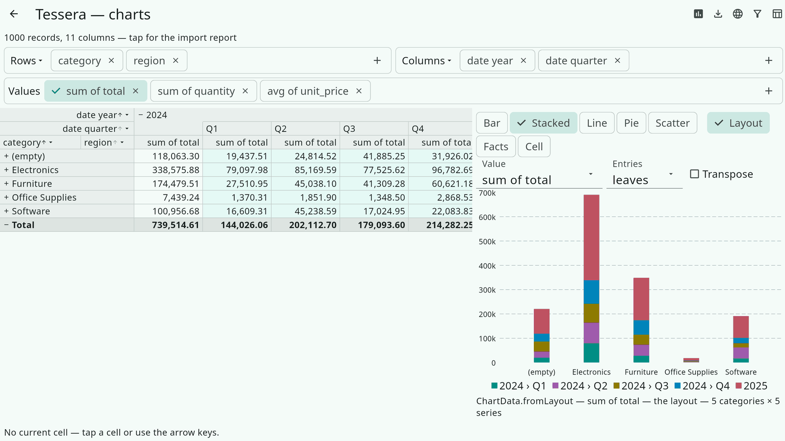

# 15. Charts

Tessera draws tables, not charts — every Flutter chart package has its
own widgets, and an application usually already has one. What the engine
provides is the step before drawing: turning a cube, or the facts behind
it, into series data that any chart library takes after a few lines of
adapter. Two shapes cover the chart types a pivot feeds:

- `ChartData` — categories on one axis, one or more series of values:
  bar, column, line, area, pie, stacked variants.
- `ScatterData` — (x, y) pairs in one or more series, no category axis:
  scatter and bubble charts.

Both are plain values with labels, raw dimension values and doubles;
nothing in them knows how a chart is drawn.

## One source of truth

A chart series is a small cube: one dimension on the X axis, optionally a
second one as the series, one aggregate as Y. Rather than aggregating a
second time, every producer reads cells of a `CubeLayout`, so a chart
always shows what the table would show — the same empty-value handling,
sorting, filters and "show values as" wrappers. There are three ways in:

| Producer | Reads | Use it for |
|---|---|---|
| `ChartData.fromLayout(layout, …)` | The cube as displayed: row entries → categories, column entries → series | "Chart what I see", a chart next to the grid |
| `ChartData.fromFacts(facts, category:, series:, aggregate:, filter:)` | A one- or two-dimensional cube built for the purpose | A chart without a pivot, or independent of the pivot's axes |
| `ChartData.fromCell(layout, cell, category:, …)` | The facts behind one cell, grouped by another dimension | Drill-down: "break Germany × Q2 down by product" |

`ScatterData` has the same three, plus `ScatterData.ofFacts` which plots
individual facts (see below).

```dart
final facts = (await loadFacts(CsvDataSource.fromData(bytes))).facts;
final total = Aggregate.sum(const Measure('total'));

// total per category, one series per year
final chart = ChartData.fromFacts(
  facts,
  category: const ColumnDimension('category'),
  series: const DatePartDimension('date', DatePart.year),
  aggregate: total,
);
for (final s in chart.series) {
  print('${s.label}: ${s.values}');   // 2024: [1234.5, null, …]
}
```

`chart.categories[i].label` is the X label of `series.values[i]`; a
`null` value is a blank cell — no facts, or an aggregate without a
result — and means a gap, not a zero. `aggregateLabel` names the value
axis. `chart.withoutEmpty()` drops the "(empty)" category;
`chart.transposed()` swaps categories and series.

## Which entries become categories

A pivot axis is a tree: an expanded group's entry is its subtotal and its
children follow it. Charting every entry would count Europe and then
Germany, France … again, so `fromLayout` takes the **visible leaves** by
default — groups that are neither expanded nor the summary; every fact
lands in exactly one of them. `ChartEntries` selects otherwise:

| `ChartEntries` | Entries |
|---|---|
| `leaves` (default) | The visible leaves. On an axis without dimensions, the summary — so a cube with no column dimensions gives one series, named after the aggregate. |
| `level(n)` | Every entry at nesting depth *n*, expanded or not (`1` = the axis' first dimension). |
| `paths([…])` | Exactly these groups, in this order. |
| `all` | The axis verbatim, summary and subtotals included — a chart that mirrors the table row for row. |

```dart
final byRegion = ChartData.fromLayout(
  controller.cube.layout,
  rows: const ChartEntries.level(1),   // regions, even where countries are expanded
  columns: ChartEntries.all,           // every year and the total
  aggregate: total,
);
```

`fromFacts` and `fromCell` build a cube whose first level is expanded on
both axes, so the leaves are simply the distinct values of the
dimensions.

## Numeric and time axes

A category carries its group's raw value, not only the label, so a line
chart can put it on a real axis:

| Dimension | `ChartCategory.value` |
|---|---|
| A date or dateTime column | `DateTime` (UTC) |
| An integer column, every date part | `int` — `month` 1..12, `quarter` 1..4, `weekday` 1..7 (Monday = 1), ISO `week` |
| A number column | `double` |
| Text, boolean | `String`, `bool` |
| The empty group, the summary | `null` |

`number` and `date` are the typed getters. For nested date parts —
`[date.year, date.quarter]` — the deepest value alone (`2`) says nothing
on a time axis, so `periodStart` composes the path into the first instant
of the period: 2024 › Q2 → 2024‑04‑01, 2024 › 11 › 30 → that day, a year
and an ISO week → the week's Monday. It is `null` when the path has no
usable parts (a month without a year, a weekday, text). A time axis
wants `withoutEmpty()` first: the empty group has no position.

Only groups with facts exist in a cube, so a month without sales is
absent, not zero. On a true time axis that is the right thing — the line
spans the gap; an application that wants a zero bar there fills it in.

## Drill-down from a cell

`fromCell` combines the cube's filter with the cell's coordinate
(`Coordinate.toFilter()`, `cellFilter(layout, cell)` if you want the
filter itself) and builds the cube over the result. The category may be
any dimension, on the pivot or not:

```dart
final cell = controller.currentCell;
if (cell != null) {
  final drill = ChartData.fromCell(
    controller.cube.layout,
    cell,
    category: const ColumnDimension('product'),
    aggregate: total,
    sort: AxisSort(
      by: SortBy.aggregate,
      aggregate: total,
      direction: SortDirection.descending,
    ),
  );
}
```

## Scatter charts

A scatter chart plots two quantities against each other, one point per
*thing*; the thing is either a group (two aggregates, e.g. average unit
price against total quantity per product) or a fact (two measures, one
point per sale):

```dart
// per group: a point per product, a series per region
final groups = ScatterData.fromFacts(
  facts,
  points: const ColumnDimension('product'),
  series: const ColumnDimension('region'),
  x: Aggregate.average(const Measure('unit_price')),
  y: Aggregate.sum(const Measure('quantity')),
);

// per fact: the sales behind the current cell
final sales = ScatterData.ofFacts(
  facts,
  x: const Measure('unit_price'),
  y: const Measure('quantity'),
  series: const ColumnDimension('region'),
  pointLabel: const ColumnDimension('product'),
  rows: cell.factRows,
  limit: 5000,
);
```

`ScatterPoint` has `x`, `y`, a `label`, and either the group's `path`
with its `factCount` or the fact's `row` index; a point with a missing
coordinate is left out. `xLabel`/`yLabel` name the axes; a series
without a dimension is single and unnamed. `ofFacts` takes a `filter`,
an explicit row set (`CubeCell.factRows`) and a `limit`, because two
million points are not a chart.

## The Charts example

The demo app's *Charts* page (`packages/tessera_flutter/example/lib/charts/`)
is this chapter as a UI: a live chart beside the grid, chips for the
chart type (bar, stacked, line, pie, scatter) and the source (Layout /
Facts / Cell = `fromLayout` / `fromFacts` / `fromCell`), and only the
controls that apply — the value (or X and Y) among the pivot's own
aggregates, the category and series dimensions in Facts and Cell mode
with the dimensions the current cell pins disabled, the entry selection
and transposition in Layout mode, and "per fact" for a scatter of the
cell's rows. The caption under the chart names the producer, the cell
and the sizes; the line chart says which axis kind the category values
gave it. `chart_widgets.dart` holds the whole `fl_chart` adapter, one
function per chart type.



## Feeding a chart library

The adapter is the application's, and short. With
[`fl_chart`](https://pub.dev/packages/fl_chart):

```dart
LineChart(LineChartData(
  lineBarsData: [
    for (final s in chart.series)
      LineChartBarData(spots: [
        for (var i = 0; i < s.values.length; i++)
          if (s.values[i] case final v?)
            FlSpot(chart.categories[i].periodStart!.millisecondsSinceEpoch.toDouble(), v),
      ]),
  ],
));
```

A bar chart uses `categories[i].label` for the group titles and
`series[j].label` for the legend; a pie chart uses one series. Labels
are localized through the `strings` parameter every producer takes, the
same `TesseraStrings` the exporters use. A label is the group's own
value — `Africa`, `Q1` — so when the leaves sit at mixed depths
(`Electronics › Africa` next to `Furniture`, or 2024's quarters next to
2025) the `path` tells them apart; the example's adapter prepends the
ancestors from `path.entries` in that case (`pathLabel`).
